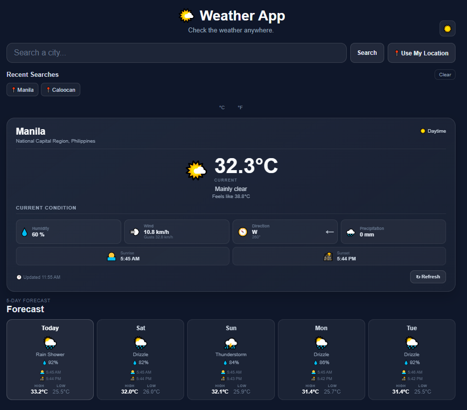

# 🌤️ Weather App



A responsive weather application built with React that provides current weather conditions, a 5-day forecast, location-based weather, recent searches, temperature unit conversion, and dark/light mode.

## 🔗 Live Demo

https://melvin-12143031.github.io/my-weather-app/

## 📖 About

This project is a React-based weather application built using the Open-Meteo API.

Users can search for cities, view their current weather, use their current location, switch between Celsius and Fahrenheit, view a 5-day forecast, and save recent searches.

The project was built to practice working with APIs, React hooks, reusable components, custom hooks, localStorage, asynchronous JavaScript, and responsive CSS.

## ✨ Features

- 🔎 Search weather by city
- 📍 Get weather using current location
- 🌡️ Celsius / Fahrenheit conversion
- 🌤️ Current weather conditions
- 💧 Humidity
- 💨 Wind speed and gusts
- 🧭 Wind direction
- 🌧️ Precipitation
- 🌅 Sunrise and sunset
- 📅 5-day weather forecast
- ☀️ Day/night detection
- 🔄 Refresh weather data
- 🕐 Last updated time
- 🕘 Recent searches
- 🗑️ Clear recent searches
- 🌙 Dark mode
- ☀️ Light mode
- 💾 LocalStorage persistence
- ⚠️ Error handling
- ⏳ Loading states
- 📱 Responsive design

## 🛠️ Technologies

- React.js
- JavaScript (ES6+)
- CSS3
- Vite
- Git
- GitHub Pages

## 🌐 APIs

### Open-Meteo Weather API

Used to retrieve:

- Current weather
- Temperature
- Feels-like temperature
- Humidity
- Wind speed
- Wind direction
- Wind gusts
- Precipitation
- Weather conditions
- Sunrise and sunset
- 5-day forecast

### Open-Meteo Geocoding API

Used to search for cities and retrieve their coordinates.

### Nominatim / OpenStreetMap

Used for reverse geocoding when the user chooses their current location.

## 📂 Project Structure

```text
src/
├── api/
│   └── weatherApi.js
│
├── components/
│   ├── EmptyState.jsx
│   ├── ErrorMessage.jsx
│   ├── Forecast.jsx
│   ├── Loading.jsx
│   ├── RecentSearches.jsx
│   ├── SearchBar.jsx
│   ├── UnitToggle.jsx
│   ├── WeatherCard.jsx
│   ├── WeatherDetails.jsx
│   └── WeatherResults.jsx
│
├── hooks/
│   ├── useCitySearch.js
│   ├── useLocalStorage.js
│   ├── useRecentSearches.js
│   ├── useTheme.js
│   ├── useUnit.js
│   ├── useWeather.js
│   └── useWeatherSearch.js
│
├── utils/
│   ├── errorUtils.js
│   └── weatherUtils.js
│
├── App.jsx
└── App.css


⚛️ React Concepts Used

This project helped me practice:

useState
useEffect
useCallback
Custom hooks
Props
Event handling
Conditional rendering
Component composition
Async/await
Fetch API
API data handling
Error handling
LocalStorage
Reusable utility functions
💾 LocalStorage

The app stores several user preferences locally:

recentSearches
temperatureUnit
theme

This allows recent searches, temperature units, and the selected theme to remain after refreshing the page.

🎯 What I Learned

Through this project, I practiced building a complete React application from scratch and learned how different parts of a frontend application work together.

Some of the main things I learned were:

Working with external APIs
Handling asynchronous requests
Managing loading and error states
Creating reusable React components
Creating and using custom hooks
Separating API logic from UI logic
Persisting data with LocalStorage
Working with geolocation
Converting weather data for different units
Building responsive layouts
Deploying a React application using GitHub Pages
🚀 Future Improvements

Possible future improvements include:

Weather icons with more detailed animations
Hourly weather forecast
More detailed weather information
Weather alerts
Better location search results
Improved accessibility
More customization options